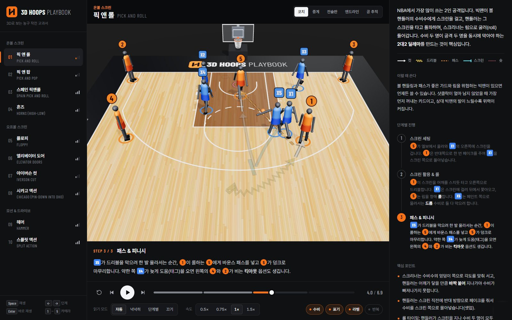

<p align="center"></p>
<h1 align="center">3D Hoops Playbook</h1>
<p align="center">
  10 offensive sets from pro basketball, replayed step by step on a 3D half court.<br>
  <a href="https://hpotty36.github.io/3d-hoops-playbook/"><b>Live demo →</b></a>
</p>

An interactive playbook that replays **10 offensive sets commonly run in pro basketball (NBA)** on a 3D half court, step by step.
Players move at real game speed, coach-style diagram notation (cuts, dribbles, passes, screens) is drawn on the floor, and every step explains what is happening and why.

> The in-app text (play descriptions, step captions, UI) is written in **Korean**. A Korean version of this README is collapsed at the [bottom of the page](#korean).



## Plays

| # | Play | Category | Difficulty | In one line |
|---|------|----------|:---:|------|
| 1 | Pick and Roll | On-ball screens | ●○○ | Screen → drive → hit the roller. The basic two-man game |
| 2 | Pick and Pop | On-ball screens | ●○○ | The screener pops to the arc instead of rolling |
| 3 | Spain Pick and Roll | On-ball screens | ●●● | P&R plus a back screen on the roller's defender |
| 4 | Horns (High-Low) | On-ball screens | ●●○ | Two bigs at the elbows: high P&R into a high-low pass |
| 5 | Floppy | Off-ball screens | ●●○ | Shooter under the rim picks a single or staggered screen |
| 6 | Elevator Doors | Off-ball screens | ●●○ | Two screeners close the "doors" behind the shooter |
| 7 | Iverson Cut | Off-ball screens | ●○○ | Wing-to-wing cut across the top of the key |
| 8 | Chicago | Off-ball screens | ●●○ | Pin-down screen straight into a dribble handoff |
| 9 | Hammer | Motion & drive | ●●○ | Baseline drive + weak-side screen → corner three |
| 10 | Split Action | Motion & drive | ●●● | Post entry, then the two off-ball players screen for each other |

Each play comes with **step-by-step breakdown · when to use it · key teaching points · how defenses counter it · famous examples**.

## Controls

| Input | Action |
|------|------|
| `Space` | Play / pause |
| `Enter` | Skip the reading pause and play the step now |
| `←` `→` | Previous / next step |
| `↑` `↓` | Previous / next play |
| `1`–`5` | Camera: Coach · Broadcast · Top-down board · Baseline · Ball follow |
| `D` `N` `L` | Toggle defense · floor notation · number labels |
| `R` | Restart |
| Mouse drag / wheel | Orbit and zoom freely |

- Drag the timeline to freeze any moment; click a step in the right panel to jump to it.
- Deep links: `#hammer` opens a play directly, and `?cam=top&t=3.5#hammer` opens it paused at 3.5 s from the top-down camera.

### Reading mode

`1×` is real game speed, which is too fast to read along. So at the start of every step the playback pauses briefly: the court already shows that step's routes and highlights the players involved while you read the caption, then the action plays.

| Mode | Behavior |
|------|------|
| Auto (default) | Pause length scales with the caption length (2.5–10 s) |
| Relaxed | 1.7× longer than Auto |
| Step-by-step | Stops at every step until you press Play, `Space`, or `Enter` |
| Off | Continuous playback |

The countdown and a **Play now** button appear next to the caption. Your reading mode, speed, and display toggles are remembered in the browser.

### Floor notation

| Mark | Meaning |
|------|------|
| White line + arrow | Cut (movement without the ball) |
| Yellow zigzag | Dribble |
| Orange dashes | Pass |
| Cyan line + T-bar | Screen |
| Pink dots | Shot |

Offense is shown as orange numbered circles (1–5), defense as blue `X1`–`X5`. While a screen is being set, a translucent "wall" appears in front of the screener.

## Run locally

It is a static site with no build step. Because it uses ES modules, serve it over HTTP instead of opening the file directly:

```bash
python -m http.server 8000
# or
npx serve .
```

Then open `http://localhost:8000`.

## Project structure

```
index.html            Layout and the Three.js import map
css/style.css         UI styles (3-column desktop / stacked mobile)
js/main.js            Entry point: scene setup, playback loop, UI wiring
js/engine.js          Compiles a play into a deterministic timeline (players, defense, ball)
js/court.js           Regulation half court (canvas texture) and the hoop
js/players.js         Mannequin player model, poses (run, defend, screen, shoot), ball
js/notation.js        Coach-board notation drawn on the floor
js/camera.js          Camera presets and transitions
js/plays/*.js         Play definitions (one file per play)
assets/logo-mark.svg  Logo mark (also the favicon)
docs/design.md        Design notes
```

## Adding a play

Create a file in `js/plays/` and register it in `js/plays/index.js`. Coordinates are in feet:

- `x`: left sideline `-25` to right sideline `25` (negative = offense's left)
- `z`: baseline `0` to half-court line `47`; the rim is at `(0, 5.25)`
- Common spots: top `[0, 31]`, wings `[±18, 22]`, corners `[±23, 3.5]`, elbows `[±8, 19.5]`, blocks `[±9, 8]`

```js
export default {
  id: 'my-play', name: '내 작전', en: 'My Play',
  category: '온볼 스크린', difficulty: 1,
  summary: '...', when: '...', keys: ['...'], famous: '...',
  counters: [{ name: 'Switch', desc: '...' }],

  start: { o1: [0, 32], o2: [-23, 3.5], o3: [23, 3.5], o4: [-19, 22], o5: [8, 18] },
  ball: 'o1',
  steps: [
    {
      title: 'Set the screen',
      dur: 1.6,                                    // step length in seconds
      text: '[5] screens for [x1].',               // [1] = offense chip, [x1] = defense chip, **bold**
      move: {
        o5: [[2.6, 28.6]],                         // waypoints (starts from the current position)
        o1: { path: [[-1.8, 32.6]], t: [0.25, 0.85] }, // t: active window inside the step (0–1)
      },
      screens: [{ by: 'o5', face: [-1.5, 29.2] }], // face: the point the screen is set toward
      def: {
        d1: { lag: 0.9 },                          // reaction delay (looks "caught" on the screen)
        d5: { path: [[3, 17.5]] },                 // explicit defender path
        // guard: 'o5' (switch), sag: 0 (no help-side sag)
      },
      ball: [
        { type: 'pass', to: 'o5', at: 0.3 },       // pass | bounce | lob | skip | handoff
        { type: 'shot', at: 0.7, pts: 2, kind: 'dunk' }, // kind: jumper | layup | dunk
      ],
    },
  ],
};
```

Unless you script them, defenders position themselves automatically: between their man and the rim, sagging toward the paint when they are far from the ball.

## Tech

- [Three.js](https://threejs.org/) r160 via CDN and an import map. No bundler or build tools
- Court lines and hardwood are a canvas-drawn texture; players are built from primitive shapes
- Type: [Pretendard](https://github.com/orioncactus/pretendard) for Korean UI text, [Barlow Condensed](https://fonts.google.com/specimen/Barlow+Condensed) for labels and numbers
- Every position is a pure function of time `t`, so you can scrub the timeline back and forth precisely

## License & disclaimer

Code is released under the [MIT License](LICENSE).

This is an unofficial, non-commercial educational project. It is **not affiliated with, endorsed by, or sponsored by the NBA or any of its teams**. "NBA" and team names are trademarks of their respective owners and are used only to describe where these publicly known basketball tactics are commonly seen. No logos, player images, or other official assets are used.

---

<a name="korean"></a>

<details>
<summary><strong>🇰🇷 한국어 README 펼치기 (Korean)</strong></summary>

### 3D Hoops Playbook

프로 농구(NBA)에서 자주 쓰이는 공격 작전 10가지를 **3D 코트 위에서 단계별로 재생하며** 배우는 인터랙티브 플레이북입니다.
선수들이 실제로 움직이고, 코트 바닥에는 코치들이 쓰는 전술판 표기(컷·드리블·패스·스크린)가 그려지며, 단계마다 지금 무슨 일이 일어나는지 한국어로 설명합니다.

**▶ 바로 보기: https://hpotty36.github.io/3d-hoops-playbook/**

### 수록 작전

| # | 작전 | 분류 | 난이도 | 한 줄 요약 |
|---|------|------|:---:|------|
| 1 | 픽 앤 롤 | 온볼 스크린 | ●○○ | 스크린 → 돌파 → 롤맨에게 패스, 가장 기본적인 2인 공격 |
| 2 | 픽 앤 팝 | 온볼 스크린 | ●○○ | 스크리너가 림 대신 3점 라인으로 빠져 슈팅 |
| 3 | 스페인 픽앤롤 | 온볼 스크린 | ●●● | 픽앤롤 + 롤맨 수비에게 거는 백스크린 |
| 4 | 혼즈 | 온볼 스크린 | ●●○ | 엘보의 두 빅맨, 하이 픽앤롤 → 하이-로우 |
| 5 | 플로피 | 오프볼 스크린 | ●●○ | 림 아래 슈터가 싱글/스태거 스크린 중 선택 |
| 6 | 엘리베이터 도어 | 오프볼 스크린 | ●●○ | 두 스크리너가 문을 닫듯 수비를 가둠 |
| 7 | 아이버슨 컷 | 오프볼 스크린 | ●○○ | 자유투 라인 위를 가로지르는 엔트리 컷 |
| 8 | 시카고 액션 | 오프볼 스크린 | ●●○ | 핀다운 스크린 → 드리블 핸드오프 |
| 9 | 해머 | 모션 & 드라이브 | ●●○ | 베이스라인 돌파 + 약한 쪽 스크린 → 코너 3점 |
| 10 | 스플릿 액션 | 모션 & 드라이브 | ●●● | 포스트 엔트리 후 공 없는 두 선수의 스크린 |

작전마다 **단계별 진행 · 이럴 때 쓴다 · 핵심 포인트 · 수비는 어떻게 막나 · 대표 사례**가 들어 있습니다.

### 사용법

| 조작 | 기능 |
|------|------|
| `Space` | 재생 / 일시정지 |
| `Enter` | 읽는 시간을 건너뛰고 바로 재생 |
| `←` `→` | 이전 / 다음 단계 |
| `↑` `↓` | 이전 / 다음 작전 |
| `1`–`5` | 카메라: 코치 · 중계 · 전술판(탑뷰) · 엔드라인 · 공 추적 |
| `D` `N` `L` | 수비 · 전술판 표기 · 번호 라벨 켜고 끄기 |
| `R` | 처음부터 다시 |
| 마우스 드래그 / 휠 | 자유롭게 회전 · 확대 |

- 타임라인을 드래그하면 원하는 순간에 멈춰서 볼 수 있고, 오른쪽 패널의 단계를 누르면 그 단계로 바로 이동합니다.
- 주소 뒤에 `#hammer`처럼 작전 id를 붙이면 그 작전이 바로 열리고, `?cam=top&t=3.5#hammer`처럼 붙이면 그 장면에서 멈춘 채로 열립니다.

### 읽기 모드

1배속은 실제 경기 속도라서 설명을 읽으며 따라가기엔 빠릅니다. 그래서 단계가 시작될 때마다 잠깐 멈추고, 그동안 코트에는 이번 단계의 동선과 관련 선수가 먼저 표시됩니다. 설명을 다 읽으면 그 단계가 실제 속도로 재생됩니다.

| 모드 | 동작 |
|------|------|
| 자동 (기본) | 설명 길이에 맞춰 2.5–10초 멈춤 |
| 넉넉히 | 자동보다 1.7배 길게 멈춤 |
| 단계별 | 단계마다 멈추고 재생(`Space`/`Enter`)을 누를 때까지 기다림 |
| 끄기 | 멈추지 않고 이어서 재생 |

설명 옆에 남은 시간과 **바로 재생** 버튼이 나타납니다. 읽기 모드, 속도, 표시 옵션은 브라우저에 저장됩니다.

### 전술판 표기

| 표기 | 의미 |
|------|------|
| 흰 실선 + 화살표 | 컷(공 없이 이동) |
| 노란 지그재그 | 드리블 |
| 주황 점선 | 패스 |
| 하늘색 선 + T자 | 스크린 |
| 분홍 점선 | 슛 |

공격은 주황색 원형 번호(1–5), 수비는 파란색 `X1`–`X5`로 표시합니다. 스크린을 거는 순간에는 스크리너 앞에 반투명한 '벽'이 나타납니다.

### 로컬에서 실행

빌드 과정이 없는 정적 사이트입니다. ES 모듈을 쓰기 때문에 파일을 더블클릭하지 말고 간단한 웹 서버로 여세요.

```bash
python -m http.server 8000
```

그다음 브라우저에서 `http://localhost:8000`을 엽니다.

### 작전 추가하기

`js/plays/`에 파일을 하나 만들고 `js/plays/index.js`에 등록하면 됩니다. 좌표 단위는 피트(ft)이고, 형식은 위 영어 섹션의 예시와 같습니다.

- `x`: 왼쪽 사이드라인 `-25` ~ 오른쪽 사이드라인 `25` (공격 방향 기준 왼쪽이 음수)
- `z`: 베이스라인 `0` ~ 하프라인 `47`, 림 중심은 `(0, 5.25)`
- 수비는 따로 지정하지 않으면 자기 선수와 림 사이에 서고, 공에서 멀면 도움 수비 위치로 처집니다.

### 라이선스 및 면책

코드는 [MIT 라이선스](LICENSE)로 공개합니다.

이 프로젝트는 비영리·비공식 교육용 자료이며 **NBA 및 각 구단과 관련이 없고, 승인이나 후원을 받지 않았습니다.** 'NBA'와 구단명은 각 소유자의 상표이며, 공개적으로 알려진 농구 전술이 어디서 주로 쓰이는지 설명하기 위해서만 언급합니다. 로고, 선수 사진 등 공식 자료는 사용하지 않습니다.

</details>
